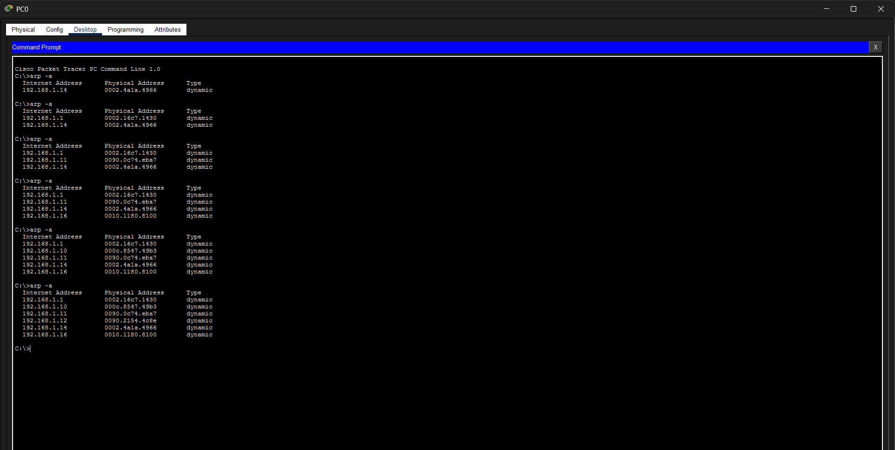
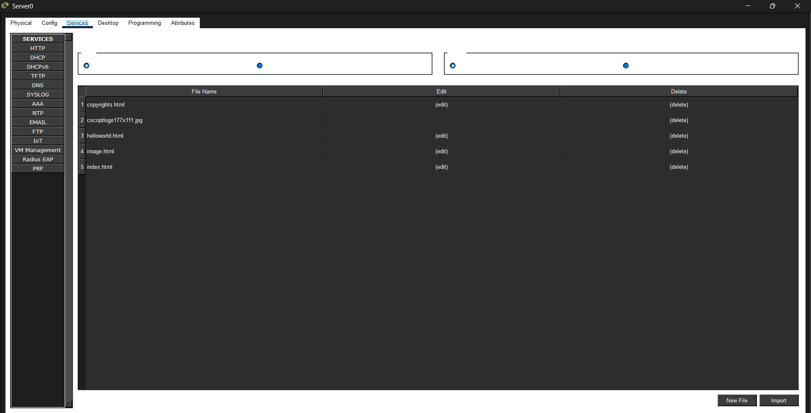

# Computer Networks AT3 - Debugging & Optimization

This repository contains my Cisco Packet Tracer files and screenshots for the AT3 debugging assignment.

## Scenario 1: Home Gateway IoT Network
* **Fault Identified:** (Write which device failed, e.g., the Garage Door was off the network).
* **Troubleshooting & Fix:** (Explain what you changed in the IP Configuration).
* **Result:** The device successfully pinged the Gateway and connected to the Smart Home App.

## Scenario 2: ARP Table Analysis
* **Fault Identified:** (Write which device failed the ping).
* **Troubleshooting & Fix:** (Explain how you fixed its IP address).
* **Result:** The ARP table successfully populated the missing MAC address. (See screenshot below).

## Scenario 3: Connect Server & Enable DHCP
* **Troubleshooting & Fix:** Connected Server-PT to the DLC100 gateway. Assigned a static IP to the server and configured a DHCP pool. Switched all IoT devices to request DHCP.
* **Result:** All devices successfully pulled an IP address from the server. (See DHCP lease screenshot below).

## Scenario 4: PDU & ICMP Analysis
* **Fault Identified:** The Motion Detector failed the initial PDU test.
* **Troubleshooting & Fix:** The port was turned off and the IP address was misconfigured. I turned the port on and set the correct IP.
* **Result:** The PDU test succeeded. Verified ICMP Type 8 (Echo Request) and Type 0 (Echo Reply).
